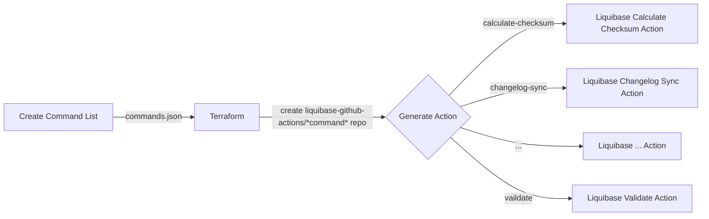

# GitHub Actions Generator
Main repository for the tools and automation to generate Liquibase GitHub Actions at https://github.com/liquibase-github-actions. Uses generated protobuf files from https://github.com/liquibase/protobuf-generator to create an action for each Liquibase command. 

