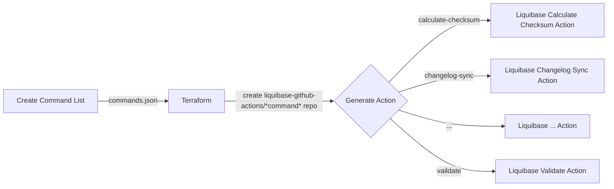

# GitHub Actions Generator

⚠️ **VERSION SUPPORT NOTICE**: This project and all generated individual Liquibase GitHub Actions support Liquibase versions up to 4.x. For Liquibase 5.0+ features and continued updates, please migrate to [`liquibase/setup-liquibase`](https://github.com/liquibase/setup-liquibase).

## Migration Information

### Current Approach (Supports Liquibase 4.x)
```yaml
# Individual actions - supported through Liquibase 4.x
- uses: liquibase-github-actions/update@v4.32.0
  with:
    changelogFile: 'changelog.xml'
    url: 'jdbc:h2:mem:test'
```

### Recommended for Liquibase 5.0+ Features
```yaml
# Single setup action with latest Liquibase versions
- uses: liquibase/setup-liquibase@v1
  with:
    version: '5.0.0'  # Supports 5.0+ features
    edition: 'oss'
- run: liquibase update --changelog-file=changelog.xml --url=jdbc:h2:mem:test
```

## About This Repository (Historical)

Main repository for the tools and automation to generate Liquibase GitHub Actions at https://github.com/liquibase-github-actions. Uses generated protobuf files from https://github.com/liquibase/protobuf-generator to create an action for each Liquibase command. 

