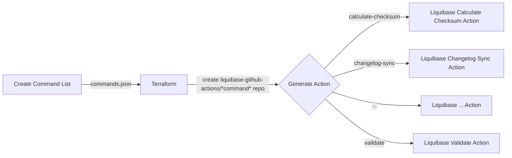

# GitHub Actions Generator

⚠️ **DEPRECATED**: This project and all generated individual Liquibase GitHub Actions will be discontinued with Liquibase 5.0. Please migrate to [`liquibase/setup-liquibase`](https://github.com/liquibase/setup-liquibase) for continued support.

## Migration Information

### Old Approach (Individual Actions - DEPRECATED)
```yaml
# Multiple individual actions for each command
- uses: liquibase-github-actions/update@v4.32.0
  with:
    changelogFile: 'changelog.xml'
    url: 'jdbc:h2:mem:test'
```

### New Approach (Recommended)
```yaml
# Single setup action, then run any command
- uses: liquibase/setup-liquibase@v1
  with:
    version: '4.32.0'
    edition: 'oss'
- run: liquibase update --changelog-file=changelog.xml --url=jdbc:h2:mem:test
```

## About This Repository (Historical)

Main repository for the tools and automation to generate Liquibase GitHub Actions at https://github.com/liquibase-github-actions. Uses generated protobuf files from https://github.com/liquibase/protobuf-generator to create an action for each Liquibase command. 

